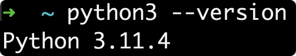
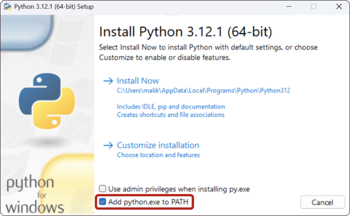
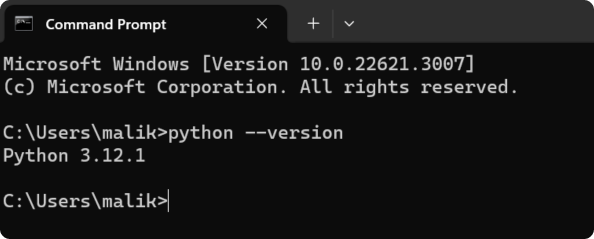
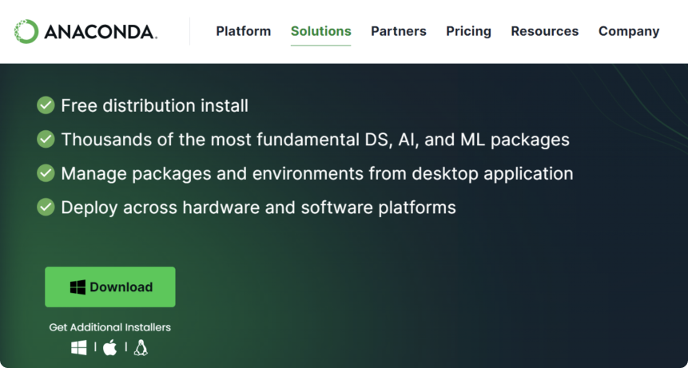
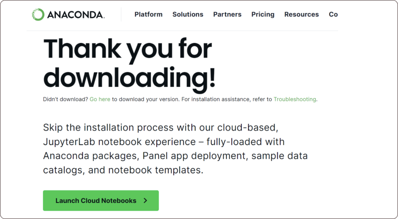

# Installation Instructions for the January 2024 Cohort

To succeed in your first coding courses, installing any software locally is not a must. You can use cloud applications like [Replit](https://replit.com), [Google Colab](https://colab.research.google.com), or [Deepnote](https://deepnote.com). These platforms are free and allow you to download Python files to your local computer (and then submit them on Canvas if you need to).

[Google Colab](https://colab.research.google.com) is particularly effective at converting between `.ipynb` (Jupyter Notebook file format) and `.py`. Therefore, we recommend getting familiar with all three.

Towards the end of Year 1, you will likely want to code locally on your machine. We recommend the following installations:

- [Python](https://www.python.org/downloads/)
- [VSCode](https://code.visualstudio.com/)
- [Jupyter Notebook](https://jupyter.org/) or [Anaconda](https://www.anaconda.com/download)

If you have permission issues but are considering a software engineering pathway, you may also want to install Node JS, which is not covered in this session as it will not be needed till later.

## Installing 🐍 [Python](https://www.python.org/downloads/) 🐍

### Check for an Existing Installation

To find the command prompt (terminal), Windows users should type “cmd” in the search bar; ‘terminal” for Mac. Mac, Linux, and Windows users can check if there is already a version installed by running one of the following commands in the command prompt:

```bash
python --version
```

or

```bash
python3 --version
```

Here is what it looks like on a Mac with a custom terminal:



For some people, only `python3 --version` will show the version, and for others, only `python --version`. Try both.

You need Python 3, a version later than 3.6.

### Downloading Python

#### Step 1. Visit the official [Python website](https://www.python.org/downloads).

The website should automatically suggest the best version for your Windows system. Click on the link to download the Python installer: Download Python 3.12.1 

#### Step 2. Run the Installer.

Go to your Downloads folder: click on the “python-3.12.1-amd64.exe”

Before you proceed, make sure to check the box at the bottom that says:

⚠️ **"Add python.exe to PATH". This step is crucial as it allows you to run Python from the Command Prompt, as shown in the figure below.**



#### Step 3. After checking the box, click on “Install Now”.

#### Step 4. Verify the Installation

Go to Windows search: type "cmd" to open a new command prompt or open a terminal on a Mac.
Type in the command prompt:

```bash
python --version
```

or

```bash
python3 --version
```



## Installing VSCode

### For Windows

#### Step 1. Visit [Visual Studio Code's website](https://code.visualstudio.com/)

#### Step 2. Click on the "Download for Windows" button to download the installer.

#### Step 3. Run the downloaded installer.

- Accept the license agreement and select your preferred settings.
- Click 'Install' and then 'Finish' once the installation is complete.

#### Step 4. Launch VSCode.
Open VSCode from the desktop shortcut or the Windows search bar.

### For Mac

#### Step 1. Visit [Visual Studio Code's website](https://code.visualstudio.com/)

#### Step 2. Click on the "Download for Mac" button to download the .zip file.

#### Step 3. Install VSCode

- Open the downloaded .zip file. This will extract the application.
- Drag the Visual Studio Code app to the Applications folder.

#### Step 4. Launch VSCode.

Open Finder and go to the Applications folder.
Double-click on Visual Studio Code to open it.

## Installing Anaconda locally

Step 1. Visit [Anacond's website](https://www.anaconda.com/download)
Step 2. Click on Download



**While waiting for the installer to download, let us start programming in the cloud**

Step 2. Click on **"Launch Cloud Notebooks"**



You need to sign in using your email address.

Once signed in you can start writing Python commands in the cloud.

Step 3. Once the installer is downloaded, go to your downloads folder and click on **“Anaconda3-2023.09-0-Windows-x86_64.exe”**

Step 4. Follow the instructions to complete the installation process

Step 5. Anaconda will start automatically, or you can start Anaconda from your Start Mmenu

Step 6. You can update Anaconda to the latest version, or you can choose to do it later

Step 7. Scroll down to the launch of Jupyter Notebook as shown below


